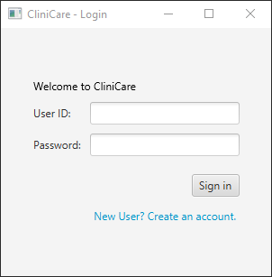
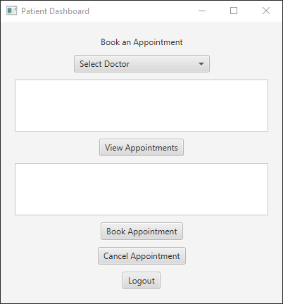
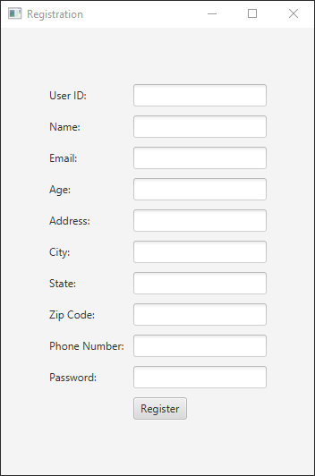
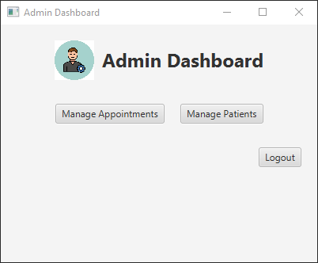
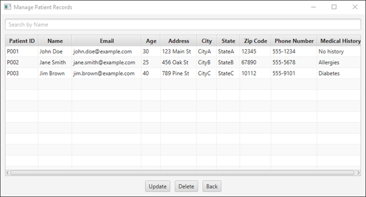
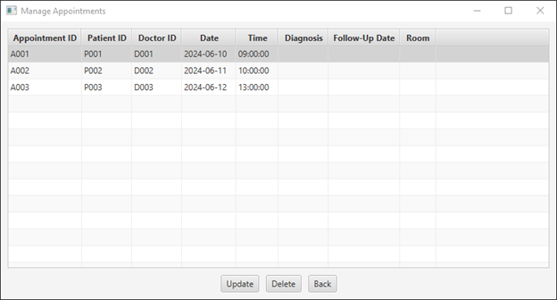

# CliniCare
This is a hospital management system called CliniCare. The purpose of the ClinicCare Hospital Management System is to streamline and enhance the management of hospital operations, focusing on providing efficient and effective services for patients and healthcare providers. Specifically, it includes features for managing patient appointments, where patients can view, cancel, and set new appointments. This system aims to improve patient experience, reduce administrative burden, and ensure smooth and organized hospital workflows.

# Technology Used for this project

1.)NetBeans IDE 8

2.) JDK 8

3.)MySQL

# ScreenShots

Login

Login Dashboard

New Account

Admin Dashboard

Manage Accounts

Manage Appointments

# UML Class Diagram

